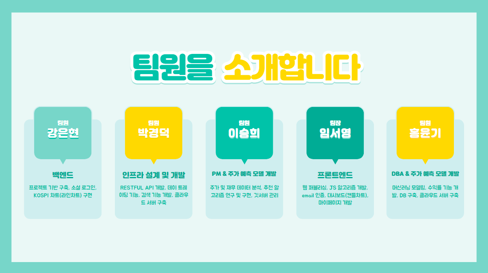

# 과목명

### : 웹 개발 프로젝트 – AI 주식 자동매매

이 과목은 주식 자동 매매를 위한 AI 기반 웹 개발 프로젝트를 다루며, 주요 내용은 분석 및 예측을 위한 데이터베이스 구축, 분석 알고리즘 및 예측 알고리즘 개발, 매매거래 주식 추천 기능 등을 구현하는 것입니다.

# 과목 개요

- 분석 및 예측 DB 구축
- 분석 알고리즘 개발
- 예측 알고리즘 개발
- 매매거래 주식 추천 기능 구현
- 웹 인터페이스 디자인 및 구현

# 과제 list

- 분석 및 예측 DB 구축
- 분석 알고리즘 및 예측 알고리즘 개발
- OPEN API(RESTful API)로 개발

### 과제 1 - 분석 및 예측 DB 구축
- 한국거래소, 네이버 금융 등에서 주식(코스피 전 종목)관련 자료를 최소 10년(2022년 기준) 이상 받아서 데이터 DB 구축함

### 과제 2 - 분석 알고리즘 및 예측 알고리즘 개발
- 예측 결과 비교 및 분석을 위해 1일전(당일 매매거래 예측 자료) Data 까지 분석 및 예측 DB에 추가함

### 과제 3 - OPEN API(RESTful API)로 개발
- Flask를 이용하여 RestAPI로 개발하여, 주가 데이터와 예측 데이터를 업데이트 함

## 과제 스크린샷, ERD 다이어그램 등
   
   
   

## 발표 ppt
   [발표자료](/ppt.pdf)
   
   

## 시연 동영상  

# 과목을 배우고 느낀점, 어려웠는데 극복한 경험,  
  - 이 프로젝트를 통해 개념 이해, 문제 해결, 그리고 팀 협업에 대한 중요성을 명확히 깨달았습니다.
  - 프로젝트 진행 중에 이해가 어려웠던 개념이 있었는데, 책이나 인터넷을 참고하고 친구들과 토의를 거쳐 이 개념을 정확히 이해했습니다.
  - 다른 사람과 의견을 나누고 협력하여 문제를 해결하면서 더 나은 결과를 얻을 수 있다는 것을 명확하게 깨달았습니다.
  - 우리 팀은 새로운 개념을 프로그래밍에 적용해보았는데, 이로써 효율성이 향상되고 안정성이 높아졌습니다.
  - 팀 프로젝트에서는 서로의 강점을 살려 효율적으로 의사 소통하고 결정하는 것이 중요하며, 이를 통해 프로젝트의 성공을 이끌어낼 수 있습니다.
